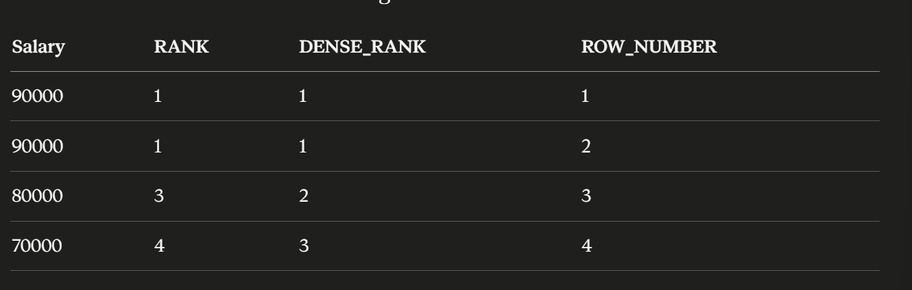

Nth highest salary : DENSE_RANK()

SELECT salary
FROM (
SELECT salary, DENSE_RANK() OVER (ORDER BY salary desc) as rank from employees
) ranked

where rank = N;

DENSE_RANK assigns the same rank to equal salaries and does not skip the next rank unlike RANK. SO, for same salary of 100000 rank will be same.

BUT if RANK is used it will create gaps, for two same salary it will award them same rank but will skip the next posssible rank.

What if N is NULL or 0 or negative ?

SELECT salary
FROM (
SELECT salary, DENSE_RANK() OVER (ORDER BY salary DESC) AS rnk
FROM employees
) ranked
WHERE rnk = N AND N > 0;

also add a backend check for n .

What if table is empty and desired result is null?

select max(salary) as SecondHighestSalary
FROM
(
Select salary, DENSE_RANK() over
(order by salary desc) as rnk
from employee
) ranked

where rnk = 2;

MAX over an empty result returns NULL instead of no rows.

CTE solution :

WITH ranked AS (
SELECT salary, DENSE_RANK() OVER (ORDER BY salary DESC) AS rnk
FROM employees
)
SELECT salary
FROM ranked
WHERE rnk = N;

Why the subquery ?
SQL does not execute in the order you write it. The engine processes clauses in this order:

FROM
→ JOIN
→ WHERE
→ GROUP BY
→ HAVING
→ SELECT ← window functions compute HERE
→ DISTINCT
→ ORDER BY
→ LIMIT

Materialized view:
If this query runs thousands of times per day, you do not want to re-sort the entire table every time. A materialized view pre-computes and stores the result physically:

CREATE MATERIALIZED VIEW ranked_salaries AS
SELECT salary, DENSE_RANK() OVER (ORDER BY salary DESC) AS rnk
FROM employees;

Materialized View Does NOT Make Sense When:
data changes frequently
freshness critical
query inexpensive

PARTITION BY explanation
Right now your window computes rank across the entire table:
sqlDENSE_RANK() OVER (ORDER BY salary DESC)
This gives you the Nth highest salary across all employees globally.

DENSE_RANK() OVER (PARTITION BY department ORDER BY salary DESC)
The ranking resets for each department. Alice is rank 1 in Eng, Dave is rank 1 in Sales independently.
So to get the 2nd highest salary per department:

SELECT name, department, salary
FROM (
SELECT name, department, salary,
DENSE_RANK() OVER (PARTITION BY department ORDER BY salary DESC) AS rnk
FROM employees
) ranked
WHERE rnk = 2;
